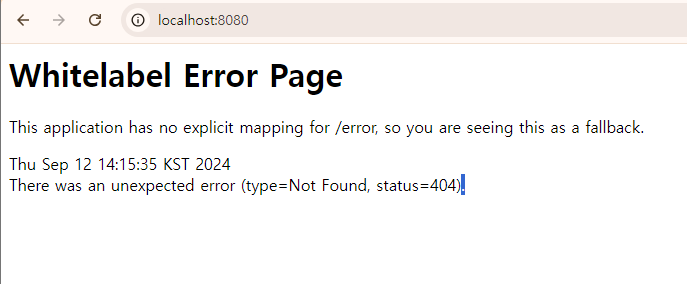

- 서버와 클라이언트 : 서버에 요청, 클라이언트에 응답 전송
- 프로토콜 : 통신 규칙  ex. http
- http 요청
    - http method
        - get, post(생성), put(교체), patch(수정), delete
    - URL
        - https://www.example.com/user/1/nickname
        - 프로토콜://서버 주소(도메인)/서버 내 데이터 위치 (path)
        - path parameter :  https://www.example.com/user/{user_id}/nickname
        - query string (조건) : https://www.example.com/post/search?page=1&keyword=hello
    
    - http 메세지
        - header : 통신에 대한 정보 ex. 언제, method 종류 등
        - body : 주고 받으려는 데이터. 보통 json 형식이다.
        - 응답 데이터에 상태 코드 有
            - 200(ok), 400(클라이언트 요청 오류), 500(서버 에러)
            
- 프론트엔드와 백엔드
    - 자주 변하지 않는 화면 UI(프론트)와, 자주 변하는 컨텐츠(백엔드)를 분리
    - 프론트는 화면에 채울 컨텐츠 데이터를 백엔드에게 요청
    - 백엔드는 DB에서 가져온 컨텐츠 데이터를 프론트에게 응답 +) 백엔드끼리는 json형식으로 통신
- API
    - 어플리케이션과 소통하는 구체적인 방법을 정의함, http 통신
    - 백엔드 api : 각 요청에 대해 어떤 응답을 보내는지 정의한 것

---

- 프로젝트 진행 과정
1. API 설계
2. DB, ERD 설계
3. API 서버 프로그램 작성
4. 테스트
5. 배포

- 1주차 과제 : api 명세 작성하기
    - API 명세를 작성할 때는 request body, request header, response body,
    status code 등도 함께 정의해야 한다.    이번 과제에서는 HTTP Method, URL만 정의해보자

할 일 전체 조회 : GET /todos   
할 일 생성 : POST /todos   
할 일 수정 : PATCH /todos/{todo_id}   
할 일 삭제 : DELETE /todos/{todo_id}   
할 일 체크 : PATCH /todos/{todo_id}        
할 일 체크해제 : PATCH /todo/{todo_id}   
* http request body에 { "checked": true } or { "checked": false } 데이터 필드 포함해서 보내기 *

   
   
