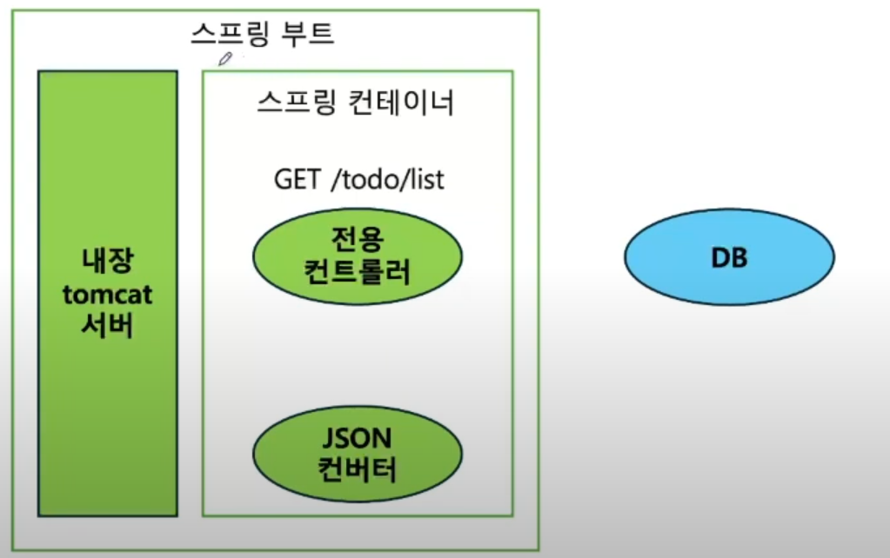

# 3주차

3주차 목표

1. 스프링 컨테이너에 스프링 빈을 저장하는 방법
2. 스프링 컨테이너에서 스프링 빈을 받아오는 방법

---
  
- 스프링 :  JAVA 진영의 대표적인 백엔드 프레임워크. 객체지향 원칙을 지키면서 개발할 수 있도록 도와줌
- 스프링 부트 : 스프링을 사용하여 개발할 때, 편의를 더해주는 도구.

1. GET 요청을 받으면, 요청에 맞는 메소드를 가진 전용 컨트롤러 호출
2. 그 컨트롤러는 DB에서부터 GET에 맞는, 전체 목록 데이터을 가져옴
3. 전용 컨트롤러가 반환한 JAVA 객체 데이터를, 스프링 내장 JSON 컨버터로 바꿈
4. 스프링 부트의 tomcat 서버에 JSON 객체를 보냄

- 스프링 빈
    - 어플리케이션 전역에서 사용할 공용 **객체**
    - 스프링 컨테이너라고 하는 공용 창고에서 Bean (객체) 를 저장해두고, 또 다른 빈이 요구하는 빈을 컨테이너에서 받아 사용한다. // 스프링 컨테이너가 알아서 의존성을 주입해줌
    
    →  주로 의존성 주입을 위해 사용된다.
    
- 스프링 컨테이너
    - 어플리케이션 컨텍스트

---
  
- 스프링 빈 저장하는 방법
1. **설정 파일 작성 (수동 등록)** in test 패키지(in 자바, 폴더 == 패키지)

// 어플리케이션의 구조가 복잡하고 여러 빈을 한 번에 관리해야 할 때    ex) 빈의 초기화 순서 관리가 필요할 때, 외부 설정 파일을 사용해야 할 때

**※** main 폴더 밑에, bean 패키지 밑에, MyBean 클래스 생성 : `public class MyBean{}`

**※** test 폴더 밑에**,** bean 패키지 밑에, **자바 클래스**로 작성 (스프링에서는 @ 덕분에 클래스가 파일처럼 동작하는구나..)

- TestConfig 클래스
    
    
    
    - 이때 클래스에는 **@Configuration** 을 추가하여 **설정 파일**임을 명시한다.
    - 내가 만들고 싶은 빈 ex.”MyBean” 만들기
        - **@Bean** 을 이용하여 빈 수동등록.
    
    → 스프링 컨테이너를 생성할 때, 컨테이너에 등록할 빈 정보가 담긴 Config 클래스를 넘길 수 있다!
    
- BeanTest 클래스 (빈이 실제로 등록되었는지 테스트 하는 코드)
    
    
    
    
    
    - **ApplicationContext**
        - 스프링 컨테이너의 기능을 정의. 실제로는 ApplicationContext의 여러 구현체 중 하나를 사용하는 것!!
        - 클래스가 아닌 인터페이스!!! 그 구현체 클래스를 만들어줘야 한다.
        

- org.springframework.context : ApplicationContext, BeanFactory 같은 중요한 인터페이스들이 있다..
- 스프링 컨테이너 안에서 같은 빈을 여러번 요청해도, 컨테이너에 등록된 **하나의 객체**! 항상 같은 객체(빈)가 반환된다.
    
    
    
    
    
    - 같은 고유값!
    - 만약에 `MyBean myBean3 = new MyBean();` 처럼 스프링 컨테이너에서 부르지 않으면 다른 고유값이 출력됨

1. 컴포넌트 스캔 (자동 등록)

※ 빈을 생성할 클래스에 **@Component** 추가

- 어플리케이션 컨텍스트를 만들 때(어플리케이션이 실행될 때), 컴포넌트 스캔이 발생한다.  @Component 가 붙은 클래스를 찾아서 자동으로 빈 등록을 마친다!

- main의 application 실행 코드 안에 **@SpringBootApplication** 을 통하여, 별도의 설정파일(TestConfig) 없이 빈을 만들 수 있다.
    
    
    

---
  
- 빈을 사용할 때, 직접 컨테이너에 접근하지 않고, **프레임워크**에게 필요한 빈(의존성)을 요청하고 받아서 사용하는 방식.
- 스프링에서는, 두 객체가 모두 빈이여야(스프링에 의해 관리되어야) 의존성을 주입할 수 있다.
    - OCP(Open Close Principle) : 변경에는 닫혀있고 확장에는 열려있다. 객체지향 원칙 준수!
    - 매번 객체 생성 → 메모리 낭비.. ↔ 생성해둔 객체 생성 → 메모리 효율적 사용
- `private MySubBean myBean` : mySubBean의 의존성을 myBean 에 주입
    - MyBubBean 클래스 생성, 빈으로 등록(@Component)
    - MyBean 클래스에 의존성 주입 및 **@Getter** 추가  

  
1. 생성자 주입 (주로 어플리케이션 코드에 적용)
- 의존성 주입 **통로**가 필요 → 생성자 위에 통로 표시 **@Autowired**
    - Autowired 어노테이션이 붙은 생성자를 보고 해당 빈을 찾아서 생성자에 자동 전달.
    - 생성자가 하나밖에 없는 경우에는 @Autowired 생략해도, 생성자로 의존성 주입 가능.
- 의존성이 바뀔 일 없는 경우 **final** 선언 //  `private **final** MySubBean mySubBean;`
    - final 키워드로 의존성 주입 시, 객체 초기화가 꼭 필요(생성자)
    - @Autowired 와 같이 사용할 수 없다.
- **@RequiredArgsConstructor** (lombok이 제공)→ 생성자도 자동으로 만들어줌.. ㄷㄷ
    
    
    
- 의존성 주입 테스트 : myBean의 부모 빈 == mySubBean

1. 필드 생성 (주로 테스트 코드에 적용)
- 필드 안에 바로 @Autowired 어노테이션을 사용한다.

- 테스트에서 필드 주입을 하려면, 테스트를 실행할 때 이미 스프링 컨테이너가 존재해야 한다.
    - `ApplicationContext context = new ~~(TestConfig.class)` // 직접 컨테이너를 만든 거.
    - 클래스에 **@SpringBootTest**을 사용하면, 어플리케이션에 있는 모든 빈을 컨테이너에 등록한 후 테스트한다. 스프링 부트까지 실행시키므로, **통합 테스트**에도 사용할 수 있다.

---
  

- 컨트롤러, 서비스, 레포리토지 까지가 Application.
- 어플리케이션과 외부환경(ex.DB)은 JPA를 통해 소통한다.

1. 요청이 들어오면, 그에 맞는 전용 **컨트롤러**가 요청을 받는다.
    1. 컨트롤러와 서비스는 **DTO** 라는 데이터 객체를 사용하여 소통한다.
2. 컨트롤러는 **서비스**의 기능을 통해 요청을 처리한다.
    1. 서비스는 어플리케이션의 비즈니스 로직(어플리케이션의 진짜 할 일..)이 담겨있다.
3. 서비스는 **레포리토리**에 또 의존…
    1. 레포리토리에는 DB와 소통하는 코드가 담겨있다. 서비스가 결정한 비즈니스 로직을 실제 DB에 적용하는 코드. 

→ 컨트롤러, 서비스, 레포리토지는 모두 스프링 빈으로 등록한다!