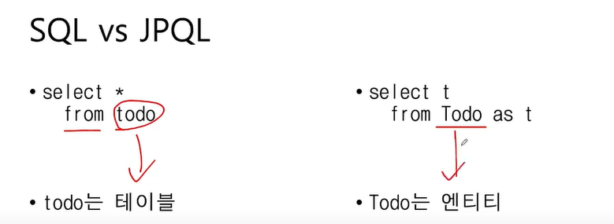

# 5주차

JPA : 자바 객체(엔티티)와 DB 매핑 도구
엔티티를 통해 테이블을 설계 → JPA가 알아서 테이블도 생성함

레포리토지 계층

- DB와 소통하며 데이터를 조작하는 계층
- 서비스 계층이 결정한 비즈니스 로직을 실제 DB에 적용
- CRUD 기능 구현 → JPA 제공 기능 이용하기

엔티티 매니저

- **application.yaml** 정보를 이용해 Entity Manager 생성
- 직접 DB와 소통하는 객체.
- 새로 생성한 엔티티 객체를 DB에 추가
- DB에서 조회한 데이터로 엔티티 객체 만들기
- 나중에 일괄적으로 영속성 컨텍스트를 보고 SQL 문 작성 및 쿼리 날림
    - 엔티티 객체에 대한 수정, 삭제 변경사항 DB에 적용하기

트랜잭션 (단위 묶기.. 운명공동체 만들기)

- JPA는 DB처럼 트랜잭션 단위로 동작함
- 트랜잭션이 끝나면 모든 변경사항을 한 번에 DB에 반영한다.
- 트랜잭션 중간에 에러가 발생하면 트랜잭션 범위 안의 모든 변경점을 롤백한다.

영속성 컨텍스트

- DB에서 조회한 엔티티를 캐싱하는 공간
- JPA가 DB에 반영할 엔티티의 **변경 사항**을 임시 보관하는 공간

데이터를 만든다 == 엔티티 클래스의 생성자를 통해 객체를 만든다.

---

비영속 상태 : 엔티티 객체만 만든 상태

- 시작) 엔티티 매니저가 `em.persist()` 호출 시, 엔티티 객체를 영속성 컨텍스트 안에 등록
- 끝) insert query! todo db에 넣기 `em.flush()` → 영속성 콘텍스트에 있는 모든 엔티티를 DB에 등록

- 자동으로 select query! `em.find()` → db의 데이터 하나를 영속성 컨텍스트에 가져오기
- 두 번째 조회 시에는 DB에 쿼리를 보내지 않고 영속성 컨텍스트에서 가져 온다. → 동일 객체 보장

- 엔티티 매니저에게 데이터 변경을 요청하고 싶다면, 엔티티 객체를 영속성 컨텍스트에 올려두고 (`em.persist()`)
    - 영속성 컨텍스트 안에 있는 객체를 **수정** 시, 수정된 정보와 최초 상태를 비교해서 SQL 생성 (변경 감지)
    - 영속성 컨텍스트 안에 있는 객체를 **삭제** 시, 엔티티를 삭제 상태로 만든다. `em.remove()` → delete query! 로 바꿔주는 거겠지

---

<실습 : 엔티티 매니저를 통해서 **레포리토지 계층**(CRUD)을 구현하자>

1. 할 일 생성
- Todo 패키지 안에 TodoRepository 클래스 만들기 
→ 스프링 빈에 등록하기(@Component가 아닌, **@Repository** 이용)
- 레포리토지 계층은 의존하는 다른 빈이 없다. 따라서 생성자 주입 등을 할 필요 없음
- @Autowired 대신 **@PersistentContext** 사용
    - @Autowired : Spring의 일반적인 의존성 주입 방신
    - @PersistentContext : JPA의 영속성 컨텍스트에서 관리되는 엔티티 매니저 주입 전용

```cpp
//TodoRepository 안...
//Create, 만들어서 DB에 *Todo* 객체 형태의 데이터 저장.
 **public void save(Todo todo) {
    em.persist(todo);}
```

→ 트랜잭션 내에 차이점 비교해서 변경점 인지를 **영속성 컨텍스트**가 한다. 
→ 영속성 컨텍스트가 찾은 변경점들을 쿼리문으로 바꿔서, **엔티티 매니저**가 DB에 쿼리를 날린다.

※ 테스트 코드 작성 전, 4주차에 작성한 Todo 객체 생성자 부분 문제점

| annotation | 생성되는 생성자 형태 | 사용 목적 |
| --- | --- | --- |
| `@RequiredArgsConstructor` | `final` 필드와 `@NonNull` 필드만 매개변수로 받음 | 필수 필드만 초기화할 때 사용 |
| `@NoArgsConstructor` | 매개변수가 없는 기본 생성자 생성 | JPA 등 기본 생성자가 필요한 경우 |
| `@AllArgsConstructor` | 모든 필드를 매개변수로 받는 생성자 생성 | 모든 필드를 한 번에 초기화할 때 사용 |
- 직접 쓰기 귀찮아서 lombok 에서 제공하는 @RequiredArgsConstructor 을 아무것도 모르고 사용했다… 하지만 추가 설정(final, @NonNull)이 있어야 기본 생성자가 아닌 생성자가 만들어지는구나 알았다.
- 그래서 그럼 @AllArgsConstuctor 만 써야지 했는데!!!!!!!!
    - Todo 객체는 @Entity 클래스이고, JPA가 엔티티 객체를 만들 때 **기본 생성자**가 꼭 필요하다고 한다… 그래서 @NoArgsConstructor 도 추가해줌
- 그렇게 하고, Test 코드를 짜는데, 생성자를 통해 `new Todo(...)` 로 객체 생성할 때 @All로 했기 때문에 무조건 **모든** 매개 변수를 순서대로 채워야 한단다..  id 값은 @GeneratedValue 여서 내가 값을 부여할 필요 없는데 ㅠㅠ
- 그래서 **@RequiredArgsConstructor** 로 추가 설정해서 필요한 생성자를 만들려고 함
    - 근데 checked 필드가 boolean 값이고, 중간에 바뀌어야하는 값이라 필수 필드로 지정하기 까다롭다는 걸 몸소 깨달아버림
- 그래서 그냥 롬복에서 제공하는 어노테이션 안 쓰고 필요한 생성자를 직접 구현했다. ㅠ

결국 boolean인 checked은 false를 기본값으로 줬긴 함

- 테스트 코드 작성해보기

```cpp
@SpringBootTest(webEnvironment = SpringBootTest.WebEnvironment.DEFINED_PORT)
    public class TodoRepositoryTest {

        @Autowired
        private TodoRepository todoRepository;

        @Test
        @Transactional
        @Rollback(false) // 관리자 콘솔 통해 볼려구 롤백 꺼주기 
        void todoSaveTest() {
            Todo todo = new Todo("Todo Content!", false, null);
            todoRepository.save(todo);
        } //할 일 데이터가 생성 되는지만 테스트하는 거여서 member 값을 null 로..

        // in-memory-database 니까
        @AfterAll
        public static void doNotFinish() {
            System.out.println("Test Finished");
            while (true){}
        }
    }
```

  → 실제로 DB에 데이터를 넣어보고, H2 관리자 콘솔을 통해서 테이블 생성과 테이블 안의 데이터 값들을 직접 확인해보기

| Annotation | 사용 용도 | 컨텍스트 로딩 여부 | 테스트 목적 |
| --- | --- | --- | --- |
| `@Test` | 단위 테스트 | X (Spring 컨텍스트 로드하지 않음) | 개별 기능이나 메서드의 로직 검증 |
| `@SpringBootTest` | 통합 테스트 | O (Spring 컨텍스트 로드)
모든 빈 주입 (의존성 有)
실제 DB와의 통신 가능케함 | 애플리케이션 전반의 통합적 검증 |

→ 인 메모리 데이터베이스 : 자동으로 메모리(RAM) 안에 데이터베이스에 대한 공간까지 임시로 만듦 (어플리케이션 끝나면 휘발됨. 따라서 @AfterAll 뒤 코드 넣어줌)

→ @Transactional : 메서드 범위에서 트랜잭션 시작과 끝 설정, 커밋, 롤백을 자동으로 처리

→ @Rollback(false) : 테스트 환경에서는 자동으로 DB를 롤백시키는데, DB에 잘 데이터 생성되나 확인하기 위해 롤백은 꺼주었다.

2. 할 일 조회

```cpp
//TodoRepository 안...
//Read
    //단건 조회 : 한 개의 데이터 조회
    public Todo findById(Long id){
        return em.find(Todo.class, id);
    }

    //다건 조회 : 모든 데이터 조회
    public List<Todo> findAll() {
        return em.createQuery("select t from Todo as t",Todo.class).getResultList();
    }
    
    //조건 조회
    public List<Todo> findAllByMember(Member member){
        return em.createQuery("select t from Todo as t where t.member = :todo_member",Todo.class)
                .setParameter("todo_member",member)
                .getResultList();
    }
```

- 테스트 코드 작성하기

```cpp
 				@Test
        @Transactional
        void todoFindOneIdTest(){
            //given
            Todo todo = new Todo("Todo Content!", null);
            todoRepository.save(todo);

            todoRepository.flushAndClear(); // 1차 캐시 막기, DB에 select 쿼리 직접 보내기

            //when
            Todo findTodo = todoRepository.findById(todo.getId());

            //then
            Assertions.assertThat(findTodo.getId()).isEqualTo(todo.getId());
        }
 				
 				@Test
        @Transactional
        void todoFindAllByMemberTest(){
            Member member1 = new Member();
            Member member2 = new Member();
            memberRepository.save(member1);
            memberRepository.save(member2);

            Todo todo1 = new Todo("Todo Content! 1", member1);
            Todo todo2 = new Todo("Todo Content! 2", member1);
            Todo todo3 = new Todo("Todo Content! 3", member2);
            todoRepository.save(todo1);
            todoRepository.save(todo2);
            todoRepository.save(todo3);

            List<Todo> member1TodoList = todoRepository.findAllByMember(member1);
            List<Todo> member2TodoList =todoRepository.findAllByMember(member2);

            Assertions.assertThat(member1TodoList).hasSize(2);
            Assertions.assertThat(member2TodoList).hasSize(1);
        }
```

→ 이번엔 테스트만을 위해 만든 FlushAndClear() 함수를 호출하지 않더라도, select 쿼리가 생성된다..!! (findById()와 findAll(), findAllByMember() 의 차이!)




3. 할 일 수정
- 수정한 할 일을 조회하고 **트랜잭션 안**에서 객체를 수정하면, 트랜잭션이 끝날 때 엔티티 매니저가 수정 사항을 DB에 반영한다.

```cpp
 // Todo 클래스 코드 안..
 public void updateContent(String newContent){
        this.content = newContent;
    }
```

- 테스트 코드

```cpp
		    @Test
        @Transactional
        @Rollback(false)
        void todoUpdateTest(){
            Todo todo1 = new Todo("todo content1",null);
            todoRepository.save(todo1); // 조회하는 코드

            todoRepository.flushAndClear();

            Todo findTodo1 =todoRepository.findById(todo1.getId());
            findTodo1.updateContent("new content 입니다..");
            //수정하는 코드
        }
```

4. 할 일 삭제

```cpp
 	//Delete
    public void deleteById(Long todoId){
        Todo todo = findById(todoId);
        em.remove(todo);
    }
```

- 테스트 코드

```cpp
        @Test
        @Transactional
        @Rollback(false)
        void todoDeleteTest(){
            Todo todo1 = new Todo("todo content1",null);
            Todo todo2= new Todo("todo content2",null);
            todoRepository.save(todo1);
            todoRepository.save(todo2);// 조회하는 코드

            todoRepository.flushAndClear();

            todoRepository.deleteById(todo1.getId());
            //수정하는 코드
        }
```