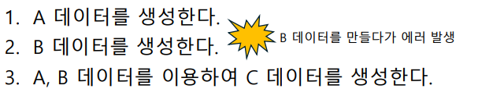

# 8주차

서비스 계층

- 어플리케이션의 **비즈니스 로직**(큰 로직 및 할지 말지 결정하는 과정)을 수행한다.
- 레포리토지 계층과 소통한다. 단위는 엔티티, DTO

<비즈니스 로직 예시>



- 세 로직은 셋 다 실행되거나, 셋 다 실행되지 않아야 한다.
- 1,2,3 을 합친 로직은 쪼갤 수 없는, 한 배를 탄 **원자성**을 가진 로직임.
    - **서비스 계층에** 메서드 단위로 **트랜잭션을 적용**해준다.
    - JPA 동작 : 트랜잭션 중간에 에러가 발생하면 트랜잭션의 처음으로 변경사항을 롤백함.
    - 여러 레포리토지 작업을 묶어서 하나의 트랜잭션으로 처리함.
    만약 레포리토지 계층에 트랜잭션을 걸 경우, 각 데이터 작업이 별도의 트랜잭션으로 처리되기 떄문에 비즈니스 로직의 원자성을 보장하지 않음.

---

<MemberService 만들기>

서비스가 뭔지 설명을 듣자마자 내가 레포리토지에 **DB 접근** 및 **단순한 CRUD** 작업을 넘어서, 비즈니스 로직까지 구현했구나 하는 느낌이 바로 들었다.

그래서 MemberRepository, MemberService 의 메소드를 다시 나눠보았다.

- MemberRepository
    - save(Member member) //Create
    - findByUserId(Long userId) // Read, 아이디(PK)로 멤버 엔티티 조회
    - findByLoginId(String loginId) //Read, 아이디로 회원 **존재 여부** 조회
    - delete(Member member) // Delete
- MemberService
    - registerMember(Member member) // 회원 가입
    - login(String loginId, String password) // 로그인
        - 사실 정확한 로그인이나 로그아웃 기능은 세션이나 토큰까지 고려해봐야 하는 것 같다.
    - deleteMember(String loginId, String password) // 회원 탈퇴

→ 각각 다시 메소드들을 구현했고, 테스트 코드도 다시 짰다..

---

<TodoService 만들기>

```java
@Transactional
    public void createTodo(String content, Long userId) throws Exception {
        Member member = memberRepository.findByUserId(userId);

        if (member == null){
            throw new Exception("존재하지 않는 유저 ID 입니다.");
        }
        Todo todo = new Todo(content,member);
        todoRepository.save(todo);
    }
```

레포리토지를 사용하는 서비스 로직에 **@Transactional** 을 붙여야 하는 이유

- 메소드 간의 원자성 보장을 위해서. (모두 실패 or 모두 성공)

---

레포리토지 테스트

- JPA, DB와의 실제 상호작용을 검증하는 테스트 → 통합 테스트 (의존성이 있기에)

서비스 테스트

- 비즈니스 로직의 **독립적** 검증이 필요함.
    - 서비스의 핵심 역할은 의존성 사용법이 아니라, 비즈니스 로직의 옳은 작동 여부이기 때문.
- 레포리토지와 같은 외부 의존성(DB) 에 접근하기 때문에, 독립적으로 검사하기 위해서 Mock 객체 사용 // `@ExtendWith(MockitoExtension.class)`
    - Mock 객체는 외부 의존성을 **대체**하여 실제로 외부랑 연결은 안 됨.

```java
@ExtendWith(MockitoExtension.class)
public class TodoServiceTest {
    
    @Mock
    private TodoRepository todoRepository;
    
    @Mock
    private MemberRepository memberRepository;
    
    @InjectMocks
    private TodoService todoService; // 실제 테스트 할 서비스 클래스
    }
```

- given() : Mock 설정
- verify()

실패 테스트 

- 실패하는 상황을 가정해야 한다
- ex. update → 존재하지 않는 todo, 권한이 없는 todo