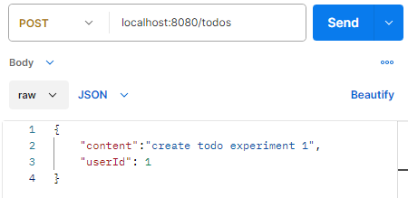

# 9주차

컨트롤러

- 클라이언트의 요청을 받고, 응답을 보내는 계층 (in HTTP)
- **DTO**를 사용하여 **서비스 계층**과 데이터를 주고 받는다.

- 동일한 객체와 관련된 요청들을 모아서 한 클래스로 만듬.
    - 클래스 안에는 GET,POST,DELETE 메서드 등이 존재함.
- 스프링 빈으로 등록된다. (싱글톤)
    - 상태 갖지 않는다.
    - 재사용
- 컨트롤러는 직접 비즈니스 로직을 처리하지 않고, **서비스 계층을 주입**받아서, 서비스 계층의 메서드를 호출하여 받은 요청에 필요한 처리들을 수행한다.
- 생성자 주입 방식 : 객체 생성 할 때 필요한 **의존성**을 생성자를 통해 주입받는다.
    - @RequiredArgsConstructor : **final**로 선언한 필드를 모두 포함한 생성자를 lombok 이 자동 생성.
- @RestController : API 엔드포인트 설정.  컨트롤러 클래스 위에 정의
- @RequestMapping(method = RequestMethod.POST, value = “/todos”)  → POST /todos 로 요청 받으면 지정한 메서드 호출
    - 메서드가 처리할 요청 메소드와 url 을 지정한다.
    - 동일 객체와 관련된 요청 → **클래스 범위** 위에 @RequestMapping(”/todos”) 해주면, 메소드 마다 path 매개변수 줄 필요 X
    - @PostMapping : 저거 매개변수 기니까..  각 메소드마다 이거 붙이기
    
    ---
    

Todo

<controller - createTodo>

```java
**@RestController**
@RequiredArgsConstructor
**@RequestMapping**("/todos")
public class TodoController {
    private final TodoService todoService;

    **@PostMapping**
    public void createTodo(){
        todoService.createTodo("content",1L);
        return;
    }
}
```

- **@RequestBody** 를 사용하여 매개변수로 들어오는 json 데이터를 DTO(자바 객체)로 변환하여 받을 수 있다

```java
dto 중 <TodoCreatekRequest> 코드
@Getter
public class TodoCreateRequest {
    private String content;
    private Long userId;
}
// CreateTodo 에 필요한 정보들 getter 정의
```

```java
 @PostMapping
    public ResponseEntity<Void> createTodo(@RequestBody TodoCreateRequest request) throws Exception{
        Long todo_id = todoService.createTodo(request.getContent(),request.getUserId());
        return ResponseEntity.created(URI.create("/todos/"+ todo_id)).build();
        // create 안에 데이터를 생성할 path 적기
    }
```

+) 서비스 계층에 DTO 객체를 통으로 넘기고, DTO에서 데이터를 꺼내는 과정은 서비스 계층에서 수행하도록 구현할 수도 있다.

+) 데이터를 꺼내는 대신, DTO 클래스에 Todo entity 객체로의 **변환 메서드**를 만들 수도 있다.

- 데이터 생성(POST)시 에는 Response Body가 없으므로 Void를 지정한다.
- ResponseEntity<T>: **HTTP 응답**을 생성하는 클래스.
    - response의 상태 코드, 헤더, 본문(body) 설정

```java
 @Transactional
    public Long createTodo(String content, Long userId) throws Exception {
        Member member = memberRepository.findByUserId(userId);

        if (member == null){
            throw new Exception("존재하지 않는 유저 ID 입니다.");
        }
        Todo todo = new Todo(content,member);
        todoRepository.save(todo);
        return todo.getId();
    }
```

createTodo 할 때는 **URI 를 만들어줘야 한다!!!!**

- 생성된 데이터의 PATH를 받아오기 위해 (/todos/{todo_id})post
    - TodoService의 메소드 반환값을 Long 으로 지정하고 todo_id 받아오기



- dto에 정의한 request 형식대로 요청을 보내준다.


- “userId” 가 1 인 유저가 없기 때문에 500 서버 오류가 날 것이다..

<controller - getTodos>

```java
@GetMapping
    public ResponseEntity<List<Todo>> getTodos(@RequestBody TodoGetRequest request) throws Exception{
        List<Todo> todos = todoService.readTools(request.getUserId());
        return ResponseEntity.ok(todos);
    }
```

- 사실 로그인한 유저 정보는 body에 직접 넣지 않는다.
관심이 있다면 Spring Security와 세션, JWT를 공부해보자.

<controller - updateTodo>

```java
@PatchMapping("/{todo_id}")
    public ResponseEntity<Void> updateTodo(@RequestBody TodoUpdateRequest request,
                                           @PathVariable Long todo_id) throws Exception{
        todoService.updateContent(todo_id,request.getLoginId(), request.getNewContent());
        return ResponseEntity.ok().build();
    }
```

- todos/{todo_id} 요청을 받아야 한다.
- @PathVariable : url 안의 값을 variable로 가져오기

<controller - deleteTodo>

```java
@DeleteMapping("/{todo_id}")
    public ResponseEntity<Void> deleteTodo(@RequestBody TodoDeleteRequest request,
                                           @PathVariable Long todo_id) throws Exception{
        todoService.deleteTodo(todo_id, request.getLoginId());
        return ResponseEntity.noContent().build();
    }
```

<controller - checkTodo>

※ CRUD만 있던 서비스 코드에, check 상태 바꾸는 메소드 추가!

```java
    @Transactional
    public void checkTodo(Long todoId, Boolean checked) throws Exception{
        Todo todo = todoRepository.findById(todoId);
        if (todo == null){
            throw new Exception("존재하지 않는 Todo 입니다.");
        }
        todo.setChecked(checked);
        todoRepository.save(todo);
    }
```

```java
    @PatchMapping("/{todo_id}")
    public ResponseEntity<Void> checkTodo(@RequestBody TodoCheckRequest request,
                                          @PathVariable Long todo_id) throws Exception{
        todoService.checkTodo(todo_id, request.isChecked());
        return ResponseEntity.ok().build();
    }
```

```java
dto 중 <TodoCheckRequest> 코드
import lombok.Getter;

@Getter
public class TodoCheckRequest {
    private boolean checked;
}
```

- lombok 에서는 boolean 필드의 getter 이름을 getChecked 가 아닌, isChecked 식으로 만든다.

---

Member controller

```java
@RestController
@RequiredArgsConstructor
@RequestMapping("/member")
public class MemberController {

    private final MemberService memberService;

    @PostMapping("/register")
    public ResponseEntity<Void> registerMember(@RequestBody Member member) throws Exception {
        memberService.registerMember(member);
        return ResponseEntity.ok().build();
    }

    @PostMapping("/login")
    public ResponseEntity<Void> loginMember(@RequestBody MemberLoginRequest request) throws Exception {
        memberService.login(request.getLoginId(), request.getPassword());
        return ResponseEntity.ok().build();
    }

    @DeleteMapping
    public ResponseEntity<Void> deleteMember(@RequestBody MemberDeleteRequest request) throws Exception {
        memberService.deleteMember(request.getLoginId(), request.getPassword());
        return ResponseEntity.ok().build();
    }
}
```

---

<실습 중Appication 실행 오류 - Controller 에 동일한 URL과 HTTP 메서드를 가진 매핑 중복>

덜덜 떨면서 application.yml 파일에 debug :true 를 추가했다..

- @PatchMapping("/{todo_id}") 를 updateTodo, checkTodo 에 둘다 사용했더니 오류남
    - 메서드의 매핑 경로를 구분하자…
    - `@PatchMapping("/{todo_id}/update")`,`@PatchMapping("/{todo_id}/check")` 로 구분해줬다…
- MemberService 코드 중, 레포리토지 주입 부분에서 `final` 키워드를 빼먹었더니 오류남
    
    ```java
    private final MemberRepository memberRepository;
    ```
    
    - 생성자에서 의존성을 누락해서 null 상태로 초기화 됐던 것임..
    - 근데 `final` 키워드를 붙여주면 컴파일러가 생성자에서 해당 필드를 반드시 초기화 하도록 요구한다.

---

<Postman api (controller) test>

DTO 클래스와 메서드의 매개변수를 확인하여 요청 바디 필드 형식을 알 수 있다.

<문제점>

회원 가입 후, 로그인을 하고 createTodo 를 해야 todo와 member가 연결이 되게, 클라이언트가 userId를 알 필요 없게 했게, 비즈니스 로직을 짰어야 했는데 테스트 하다가 느끼게 돼서 좀 아쉬웠다 ㅠㅠ

createTodo 과정에서, userId(회원가입 한 순서대로 자동으로 1부터 숫자가 설정된다.) 와 todo를 연결시키기 때문에, 사실 “로그인” 기능이 없어도 update나 delete 할 때, loginId만 일치하면 권한이 부여된다..  

1. 회원가입 요청
    
    
    
    - registerMember : findByLoginId의 반환 값이 null 이여야만 회원 가입을 할 수 있다.
        - findByLoginId에서 *찾을 수 없을 때*는 null 값이 아니라, NoResultException **오류**가 나기 때문에(getSingleresult() 이기 때문) 
        try-catch 문으로, 오류가 날 시, 오류가 아닌 null 값을 반환하도록 설정했다.
    
    ```java
    public Member findByLoginId(String loginId) {
            try {
                return em.createQuery("select m from Member m where m.loginId = :member_loginId", Member.class)
                        .setParameter("member_loginId", loginId)
                        .getSingleResult();
            }
            catch (NoResultException e) { return null;}
        }
    ```
    
    - 한 번 더 요청 하면?
        - java.lang.Exception: 이미 존재하는 회원입니다.
2. 할 일 생성
    
    
    
3. 다른 아이디에서 할 일 업데이트/삭제/체크
    
    
    
    - java.lang.Exception: 접근할 수 없는 Todo 입니다.
4. 에서 할 일 생성, 업데이트/삭제/체크
    - 같은 회원 가입 요청이 여러 번 실행 되면 중복된 loginId를 가진 회원이 DB에 저장됐지만, 비밀번호 필드가 null 상태로 저장됐다..
        - 해결책 : registerMember 메소드 `@Transactional(isolation = Isolation.***SERIALIZABLE***)`
    
    
    
    
    
- get 요청에서 requestBody 를 쓰면 400 오류가 난다..
    - get 조회 요청 코드 body 없애고, param 으로 수정

```java
@GetMapping
public ResponseEntity<List<Todo>> getTodos(**@RequestParam("userId")** Long userId) throws Exception{
    List<Todo> todos = todoService.readTools(userId);
    return ResponseEntity.ok(todos);
    }
```

- delete도 requestBody를 쓰면 안 된다고 한다. loginId를 Param 이용해서 받자 (?loginId=~~)

```java
   @DeleteMapping("/{todo_id}")
    public ResponseEntity<Void> deleteTodo(@PathVariable("todo_id") Long todo_id,
                                           @RequestParam("loginId") String loginId) throws Exception {
        todoService.deleteTodo(todo_id, loginId);
        return ResponseEntity.noContent().build();
    }
```

1번 사용자에 할 일을 생성하고, 2번 할 일 내용 업데이트, checked 여부 바꾸기 그리고 get todos 조회


2번 할 일 삭제 요청 후, 확인


